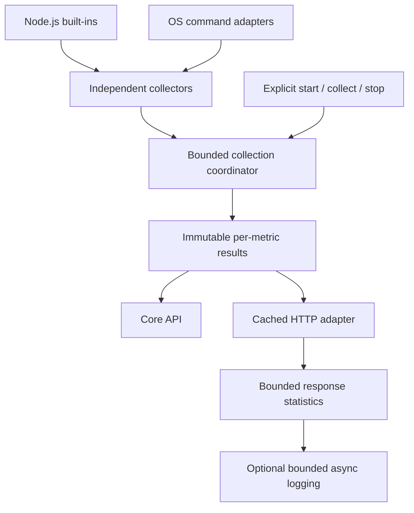

# Architecture

The package remains a single npm library with zero runtime dependencies. Root exports preserve the existing API; the `./express` entry point makes the HTTP integration explicit. HTTP declarations use structural Node.js types so core consumers do not need Express types.

`core/contracts` defines statuses, units, scopes, snapshots, and lifecycle methods. `core/monitor` owns concurrency, deadlines, cancellation, freshness, and periodic scheduling. Concurrent collection calls share one cycle. Each monitor owns its CPU/process baselines; samples never use another monitor's previous counters. Successful metrics survive another collector's failure. Snapshot timestamps expose age; old data is not refreshed or relabeled merely because a request reads it.

`collectors` holds interval samplers and requested-path disk collection. Existing diagnostic modules call `platforms/command`, which disables shells, bounds output/duration, and passes cancellation to child processes. Expected service/cron exit codes are interpreted by the diagnostic, not treated as blanket execution failures. Linux, BSD/macOS, and Windows parsing have separate fixtures. Built-in filesystem operations are asynchronous; platform facilities and hardware remain optional.

The HTTP boundary attaches cached results and compatible successful values. Response statistics listen to finish/close and settle once. They use completed responses as the error-rate denominator, retain a bounded route map, and construct copied route statistics only when requested. Headers are set before commitment; completion duration remains a separate value. Logging serializes asynchronous file/callback work behind count/byte limits and rejects flush deadlines without creating more concurrent sink work.

All collection begins through explicit lifecycle calls. Periodic timers are unref'ed, stop cancels current work, and importing the package has no I/O or scheduling side effects. Native OS filesystem requests cannot always be interrupted; cancellation prevents their late results from publishing a snapshot, while command processes are terminated through the command boundary. User logging callbacks cannot be forcibly cancelled.

`npm run check` validates lint, declarations, runtime tests, and a clean packed consumer. CI uses Node.js 22/24 across three OS families. `npm run docs` generates an API reference for review; legacy website publication is separate. Tags publish only reviewed main-branch commits with a matching version. No release job rewrites branches or versions.

Container-limit interpretation, throughput collectors, exporters, dashboards, and persistent storage are outside this release's scope. Host metrics remain explicitly labeled. See the README and migration guide for public semantics and compatibility changes.
